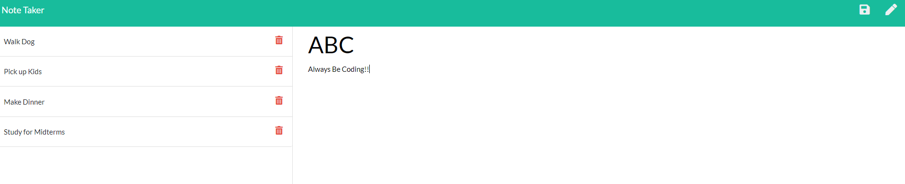

# Express_Notes
This app was designed to take quick notes for daily use.

## Purpose

Basic app to add and delete notes for everyday note taking.  This was built using Express.

## Project Description

## Resources

- Express

## Links

- Gitub: https://sterlingorth.github.io/Express_Notes/

- Source Code: https://github.com/SterlingOrth/Express_Notes.git
